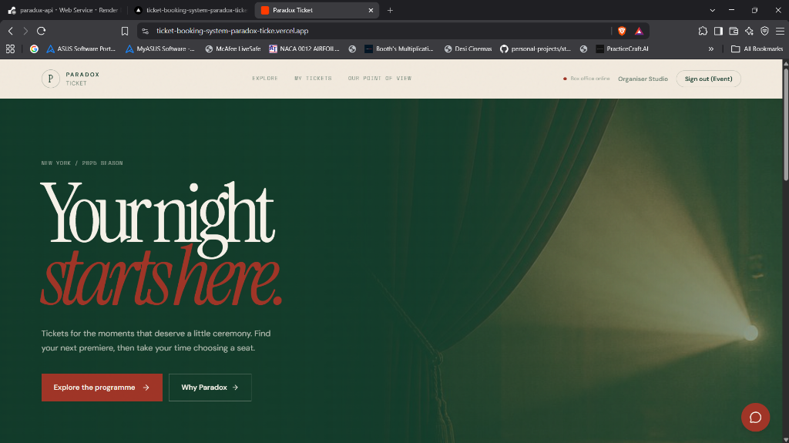
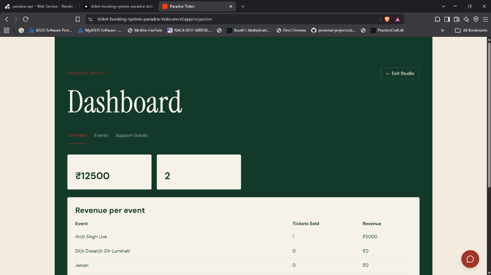
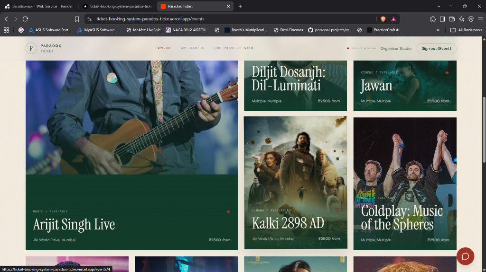
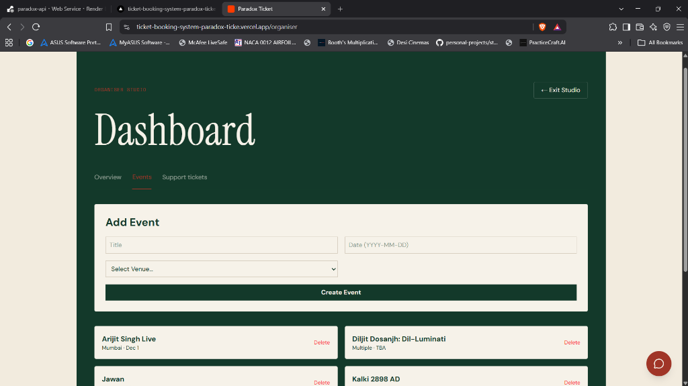
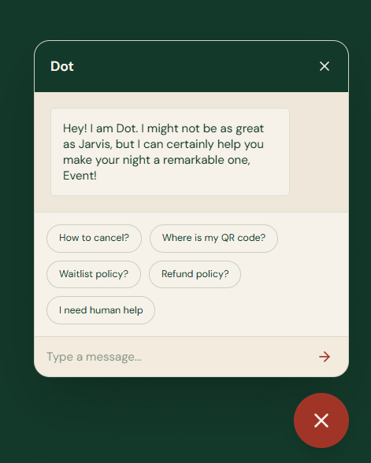

# 🎫 Paradox Ticket Platform

A full-stack event ticketing system with real-time seat maps, concurrency-safe booking, automated waitlist management, and QR-code e-tickets.

> **Live demo**: [https://ticket-booking-system-paradox-ticke.vercel.app](https://ticket-booking-system-paradox-ticke.vercel.app)

---

## Table of Contents

- [Screenshots](#screenshots)
- [Features](#features)
- [Tech Stack](#tech-stack)
- [Project Structure](#project-structure)
- [Setup Guide](#setup-guide)
- [Environment Variables](#environment-variables)
- [Database Schema](#database-schema)
- [API Documentation](#api-documentation)
- [Seat Hold & TTL Mechanism](#seat-hold--ttl-mechanism)
- [Concurrency Protection](#concurrency-protection)
- [Waitlist & Auto-Assignment](#waitlist--auto-assignment)
- [System Design](#system-design)

---

## Screenshots

| Homepage & Events | Organiser Studio |
| :---: | :---: |
|  <br> *Elegant landing page* |  <br> *Live revenue and ticket metrics* |
|  <br> *Browse upcoming shows* |  <br> *Create and manage events* |
| **Interactive Support Chatbot** | |
|  <br> *AI-powered FAQ & human handover* | |

---

## Features

| Feature | Description |
|---|---|
| **Interactive Seat Map** | 72-seat grid (6 rows × 12 cols) with Premium/Standard tiers and live status |
| **Seat Hold with TTL** | 10-minute hold using `SELECT … FOR UPDATE` + background sweeper |
| **Concurrency Protection** | Row-level PostgreSQL locks prevent double-booking |
| **Waitlist Auto-Assignment** | FIFO queue with time-limited offers on cancellation |
| **QR E-Tickets** | Booking confirmation generates a scannable QR code via QuickChart |
| **Email Notifications** | Transactional emails for bookings, waitlist offers, and confirmations |
| **Role-Based Access** | Admin / Organiser / Customer roles with JWT auth |
| **Admin & Organiser Studios** | Dashboards for user management, venue CRUD, event management, revenue metrics |
| **Support Ticket System** | AI chatbot FAQ → human escalation → organiser assignment → resolution |

---

## Tech Stack

| Layer | Technology |
|---|---|
| **Frontend** | React 19, Vite 7, Tailwind CSS v4, TanStack React Query, Wouter |
| **Backend** | Node.js, Express 5, TypeScript |
| **Database** | PostgreSQL (Neon), Drizzle ORM |
| **Auth** | JWT (jsonwebtoken), bcrypt |
| **Email** | EmailJS (with console fallback) |
| **Build** | esbuild (API), Vite (frontend), pnpm workspaces |
| **Hosting** | Vercel (frontend + serverless), Render (API server) |

---

## Project Structure

```
Paradox-Ticket-Platform/
├── .env.example                    # Template for environment variables
├── pnpm-workspace.yaml             # Monorepo workspace config
├── package.json                    # Root scripts (build, typecheck)
│
├── artifacts/
│   ├── api-server/                 # Express backend
│   │   └── src/
│   │       ├── index.ts            # Server entry + sweeper bootstrap
│   │       ├── app.ts              # Express app setup (CORS, routes)
│   │       ├── sweeper.ts          # Background hold cleanup + waitlist assign
│   │       ├── mailer.ts           # EmailJS integration
│   │       ├── middlewares/
│   │       │   └── auth.ts         # JWT verification middleware
│   │       └── routes/
│   │           ├── auth.ts         # POST /register, /login
│   │           ├── ticketing.ts    # Events, seats, holds, bookings, admin
│   │           └── waitlist.ts     # POST /waitlist/claim
│   │
│   └── paradox-ticket/             # React frontend
│       └── src/
│           ├── App.tsx             # All pages (Home, Detail, Seats, Checkout, Bookings)
│           ├── Studio.tsx          # Admin & Organiser dashboards
│           └── lib/auth.tsx        # Auth context & localStorage token
│
└── lib/
    ├── db/                         # Drizzle ORM package
    │   ├── drizzle.config.ts
    │   └── src/
    │       ├── index.ts            # Pool + Drizzle client
    │       ├── seed.ts             # DB seeding script
    │       └── schema/             # Table definitions
    │           ├── users.ts
    │           ├── venues.ts
    │           ├── events.ts
    │           ├── booking.ts
    │           └── support_tickets.ts
    ├── api-zod/                    # Zod validation schemas
    └── api-client-react/           # Generated React Query hooks
```

---

## Setup Guide

### Prerequisites

- **Node.js** ≥ 20
- **pnpm** ≥ 9 (`npm install -g pnpm`)
- A **PostgreSQL** database ([neon.tech](https://neon.tech) free tier works)

### 1. Clone & Install

```bash
git clone https://github.com/ShlokeBinani/Ticket-Booking-System.git
cd Ticket-Booking-System
pnpm install
```

### 2. Configure Environment

```bash
cp .env.example .env
# Edit .env with your DATABASE_URL and SESSION_SECRET
```

Also copy into the API server directory:

```bash
cp .env artifacts/api-server/.env
```

### 3. Push Schema & Seed

```bash
cd lib/db
pnpm run push          # Creates tables in your database
pnpm run seed          # Seeds demo events, venues, and test accounts
cd ../..
```

### 4. Build & Run

```bash
# Build everything
pnpm run build

# Or run backend only (for local dev)
cd artifacts/api-server
pnpm run dev
```

The API server starts on `http://localhost:3000`.  
The frontend (when built) is served from `public/`.

### Default Test Accounts (from seed)

| Email | Password | Role |
|---|---|---|
| `admin@paradox.com` | `password123` | Admin |
| `organiser@paradox.com` | `password123` | Organiser |

---

## Environment Variables

| Variable | Required | Description |
|---|---|---|
| `DATABASE_URL` | **Yes** | PostgreSQL connection string |
| `SESSION_SECRET` | **Yes** | JWT signing secret (64+ random chars) |
| `EMAILJS_SERVICE_ID` | No | EmailJS service ID |
| `EMAILJS_TEMPLATE_ID` | No | EmailJS template ID |
| `EMAILJS_PUBLIC_KEY` | No | EmailJS public key |
| `EMAILJS_PRIVATE_KEY` | No | EmailJS private key |

> If email variables are omitted, emails are logged to the console instead.

---

## Database Schema

The database uses **10 tables** managed by Drizzle ORM:

```
┌─────────────┐     ┌──────────────┐     ┌──────────────────┐
│   users      │     │   venues     │     │ seat_categories  │
│──────────────│     │──────────────│     │──────────────────│
│ id (PK)      │     │ id (PK)      │     │ id (PK)          │
│ email (UQ)   │     │ name         │     │ venue_id (FK)    │
│ password_hash│     │ city         │     │ name             │
│ name         │     │ address      │     └──────────────────┘
│ role (enum)  │     │ capacity     │              │
│ created_at   │     └──────────────┘              │
└─────────────┘              │               ┌──────────────┐
       │                     │               │ seat_layouts  │
       │              ┌──────────────┐       │──────────────│
       │              │   events     │       │ id (PK)      │
       │              │──────────────│       │ venue_id (FK)│
       │              │ id (PK)      │       │ category_id  │
       └──────────────│ organiser_id │       │ row          │
                      │ title        │       │ number       │
                      │ type         │       └──────────────┘
                      │ category     │              │
                      │ image        │              │
                      └──────────────┘              │
                             │               ┌──────────────┐
                      ┌──────────────┐       │  show_seats   │
                      │    shows     │       │──────────────│
                      │──────────────│       │ id (PK)      │
                      │ id (PK)      │───────│ show_id (FK) │
                      │ event_id (FK)│       │ seat_layout_id│
                      │ venue_id (FK)│       │ status (enum)│
                      │ show_date    │       │ held_by (FK) │
                      └──────────────┘       │ held_until   │
                             │               └──────────────┘
                      ┌──────────────┐              │
                      │show_pricing  │       ┌──────────────┐
                      │──────────────│       │  bookings    │
                      │ id (PK)      │       │──────────────│
                      │ show_id (FK) │       │ id (PK)      │
                      │ category_id  │       │ user_id (FK) │
                      │ price (INR)  │       │ show_id (FK) │
                      └──────────────┘       │ booking_ref  │
                                             │ total_amount │
                                             │ status       │
                                             │ created_at   │
                                             └──────────────┘
                                                    │
                                             ┌──────────────┐
                                             │booking_seats │
                                             │──────────────│
                                             │ id (PK)      │
                                             │ booking_id   │
                                             │ show_seat_id │
                                             └──────────────┘
```

**Additional tables**: `waitlist` (userId, showId, categoryId, status, offeredSeatId, offerExpiresAt) and `support_tickets` (userId, subject, message, reply, assignedTo, status).

**Enums**: `role` (admin, organiser, customer) · `seat_status` (available, held, booked) · `ticket_status` (Open, In Progress, Resolved, Terminated)

---

## API Documentation

All endpoints are prefixed with `/api`.

### Authentication

| Method | Endpoint | Auth | Description |
|---|---|---|---|
| `POST` | `/auth/register` | No | Register user. Body: `{ email, password, name, role? }` → `{ user, token }` |
| `POST` | `/auth/login` | No | Login. Body: `{ email, password }` → `{ user, token }` |

Auth uses **Bearer JWT tokens** (7-day expiry). Include `Authorization: Bearer <token>` in all protected requests.

### Events & Shows

| Method | Endpoint | Auth | Description |
|---|---|---|---|
| `GET` | `/events` | No | List all events with venue/date info |
| `GET` | `/events/:id` | No | Event detail with shows list |
| `GET` | `/shows/:id/seats` | No | Seat map for a show (with live hold expiry check) |

### Booking Flow

| Method | Endpoint | Auth | Description |
|---|---|---|---|
| `POST` | `/shows/:id/holds` | Yes | Hold seats (10-min TTL). Body: `{ seatIds: string[] }` |
| `POST` | `/bookings` | Yes | Confirm booking from held seats. Body: `{ holdId, email, paymentMethod }` |
| `GET` | `/bookings` | Yes | List user's bookings with QR codes |
| `POST` | `/bookings/:id/cancel` | Yes | Cancel booking, release seats, trigger waitlist |

### Waitlist

| Method | Endpoint | Auth | Description |
|---|---|---|---|
| `POST` | `/waitlist` | Yes | Join waitlist. Body: `{ eventId, category, email }` |
| `POST` | `/waitlist/claim` | No | Claim offered seat. Body: `{ token, email? }` |

### Admin & Organiser

| Method | Endpoint | Auth | Roles | Description |
|---|---|---|---|---|
| `GET` | `/organiser/stats` | Yes | organiser, admin | Revenue metrics & per-event breakdown |
| `GET` | `/admin/users` | Yes | admin | List all users |
| `PUT` | `/admin/users/:id/role` | Yes | admin | Change user role |
| `GET` | `/admin/venues` | Yes | organiser, admin | List venues |
| `POST` | `/admin/venues` | Yes | admin | Create venue |
| `DELETE` | `/admin/venues/:id` | Yes | admin | Delete venue |
| `POST` | `/organiser/events` | Yes | organiser, admin | Create event + show |
| `DELETE` | `/organiser/events/:id` | Yes | organiser, admin | Delete event |

### Support Tickets

| Method | Endpoint | Auth | Description |
|---|---|---|---|
| `GET` | `/support` | Yes | List tickets (scoped by role) |
| `POST` | `/support` | Yes | Create ticket. Body: `{ subject, message }` |
| `PUT` | `/support/:id` | Yes (admin/organiser) | Reply, resolve, or assign ticket |

---

## Seat Hold & TTL Mechanism

When a user selects seats, the system creates a **10-minute hold**:

1. **Hold Creation** (`POST /shows/:id/holds`):
   - Acquires PostgreSQL row-level locks with `SELECT … FOR UPDATE`
   - Validates each seat is not already booked or held by another user
   - Sets `status = 'held'`, `held_by = userId`, `held_until = NOW() + 10min`

2. **Auto-Release** — Three layers of protection:
   - **View-time filter**: `GET /shows/:id/seats` checks `held_until < NOW()` and returns expired holds as `"available"`
   - **Booking validation**: `POST /bookings` filters `heldUntil > NOW()` — returns `410 Gone` if hold expired
   - **Background sweeper**: Runs every 30 seconds via `setInterval`, bulk-releases all expired holds:
     ```sql
     UPDATE show_seats SET status='available', held_by=NULL, held_until=NULL
     WHERE status='held' AND held_until < NOW()
     ```

---

## Concurrency Protection

Simultaneous seat selection is prevented using **PostgreSQL row-level locking**:

```typescript
await db.transaction(async (tx) => {
  // 1. Lock the exact seat rows — blocks concurrent transactions
  const seats = await tx.select().from(showSeatsTable)
    .where(inArray(showSeatsTable.id, seatIds))
    .for('update');  // SELECT … FOR UPDATE

  // 2. Validate — reject if booked or held by someone else
  for (const seat of seats) {
    if (seat.status === "booked") return { error: "Seat already booked" };
    if (seat.status === "held" && seat.heldUntil > now && seat.heldBy !== userId)
      return { error: "Seat is currently held by someone else" };
  }

  // 3. Atomically mark as held
  await tx.update(showSeatsTable)
    .set({ status: "held", heldBy: userId, heldUntil: expiresAt })
    .where(inArray(showSeatsTable.id, seatIds));
});
```

If two users try to hold the same seat at the same instant, PostgreSQL's `FOR UPDATE` lock ensures the second transaction **blocks** until the first completes, then sees the updated status and returns `409 Conflict`.

---

## Waitlist & Auto-Assignment

The waitlist follows a **FIFO queue with time-limited offer** pattern:

### Flow

```
User joins waitlist → status: "waiting"
         │
    Seat becomes available (cancellation or sweeper)
         │
    Oldest "waiting" entry gets the offer
         │
    ├── status: "offered", offeredSeatId set
    ├── Seat held for 10min (cancellation) or 1hr (sweeper)
    └── Email notification sent with claim link
         │
    ┌────┴────┐
    │ Claimed │ → Booking created, seat marked "booked", waitlist "claimed"
    └────┬────┘
         │ (expired)
    Seat released back to "available" → next waitlister offered
```

### Two Assignment Triggers

1. **Immediate** (on booking cancellation): 10-minute claim window
2. **Background sweeper** (every 30s): Scans for available seats, offers with 1-hour claim window

### Claim Endpoint (`POST /waitlist/claim`)

- Validates offer status and expiry
- If expired: marks waitlist entry as `"expired"`, releases seat back to `"available"`
- If valid: creates booking atomically in a transaction, marks seat `"booked"`, sends confirmation email

---

## System Design

See [SYSTEM_DESIGN.md](./SYSTEM_DESIGN.md) for the full 800-word system design write-up covering architecture decisions, seat hold TTL, concurrency prevention, waitlist flow, and time-limited offer handling.

---

## License

MIT
